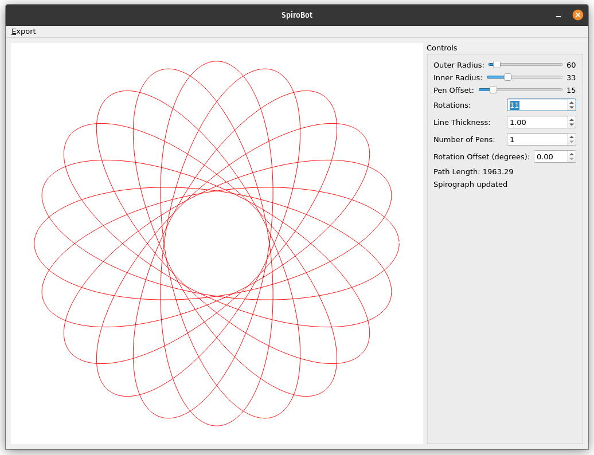

# SpiroBot

<div style="background-color: #ffcccc; border: 2px solid #ff0000; padding: 10px; margin: 10px 0; font-size: 18px; color: #ff0000; font-weight: bold;">
⚠️ WARNING: The G-code generation feature in this project has been tested with a FluidNC-based drawing bot. However, it probably won't work until it has been adjusted for your particular machine. Use at your own risk. No refunds.
</div>

## Project Overview

SpiroBot is a project that combines the artistic beauty of spirographs with modern robotics and computer-aided design.

SpiroBot is designed to create intricate spirograph patterns using a combination of software and hardware components. It allows users to design spirograph patterns digitally and then translate these designs into physical drawings using a robotic arm or CNC-like setup.

## Configuration

The `config.json` file can be configured to set default values for the application. Please refer to this file to customize the behavior of SpiroBot for your specific setup.

## Screenshots

### Early Design Concept


This image shows an early design concept for the SpiroBot application. It illustrates the basic layout and key components of the user interface.

### Early Build


This screenshot captures an early build of the SpiroBot application. It demonstrates the progress made in implementing the design and provides a glimpse of the actual user interface.

## Key Features

- Digital spirograph pattern designer
- G-code generation for physical drawing (requires machine-specific adjustments)
- Integration with robotic drawing systems

## Project Structure

- `src/`: Contains the source code for the project
- `include/`: Header files for the project
- `docs/`: Documentation files
- `tests/`: Unit tests for the project
- `resources/`: Additional resources and assets
- `images/`: Screenshots and visual assets
- `config.json`: Configuration file for default settings

## Prerequisites

### Installing Qt

SpiroBot requires Qt to be installed on your system. 

#### For Ubuntu Jammy (22.04)

You can install Qt using the package manager with the following command:

```bash
sudo apt-get update && sudo apt-get install qt6-base-dev
```

This will install the Qt6 development files and libraries necessary for building Qt applications.

#### For other systems

Follow these general steps to install Qt:

1. Visit the official Qt website: https://www.qt.io/download
2. Choose the open-source version of Qt for your operating system.
3. Download and run the Qt Online Installer.
4. During installation, select the latest Qt version (e.g., Qt 6.x) and the components you need (at minimum, select "Desktop gcc" for Linux or the equivalent for your OS).
5. Complete the installation process.

After installation, make sure to add Qt to your system's PATH environment variable:

For Linux:
```bash
echo 'export PATH="/path/to/Qt/6.x.x/gcc_64/bin:$PATH"' >> ~/.bashrc
source ~/.bashrc
```

Replace "/path/to/Qt/6.x.x" with the actual path where Qt is installed on your system.

## Building the Project

This project uses CMake as its build system. To build the project:

```bash
mkdir build
cd build
cmake ..
make
```

## Contributing

Contributions to SpiroBot are welcome! Please refer to our contributing guidelines for more information.

## License

MIT License with AI Contribution Acknowledgment

Copyright (c) 2023 SpiroBot Contributors

Permission is hereby granted, free of charge, to any person obtaining a copy
of this software and associated documentation files (the "Software"), to deal
in the Software without restriction, including without limitation the rights
to use, copy, modify, merge, publish, distribute, sublicense, and/or sell
copies of the Software, and to permit persons to whom the Software is
furnished to do so, subject to the following conditions:

The above copyright notice and this permission notice shall be included in all
copies or substantial portions of the Software.

THE SOFTWARE IS PROVIDED "AS IS", WITHOUT WARRANTY OF ANY KIND, EXPRESS OR
IMPLIED, INCLUDING BUT NOT LIMITED TO THE WARRANTIES OF MERCHANTABILITY,
FITNESS FOR A PARTICULAR PURPOSE AND NONINFRINGEMENT. IN NO EVENT SHALL THE
AUTHORS OR COPYRIGHT HOLDERS BE LIABLE FOR ANY CLAIM, DAMAGES OR OTHER
LIABILITY, WHETHER IN AN ACTION OF CONTRACT, TORT OR OTHERWISE, ARISING FROM,
OUT OF OR IN CONNECTION WITH THE SOFTWARE OR THE USE OR OTHER DEALINGS IN THE
SOFTWARE.

AI Contribution Acknowledgment:
This project was primarily generated by artificial intelligence, specifically
Anthropic's Claude. The AI's role in creating this software should be
acknowledged and considered when using, modifying, or distributing this work.

By using this software, you acknowledge that it was created with the assistance
of AI and agree that the licensing of this work may be affected or tainted by
the involvement of AI-generated content. Users should consider the potential
legal and ethical implications of using, modifying, or distributing AI-generated software.
